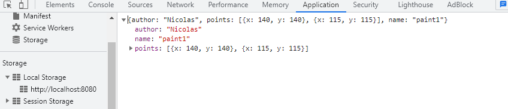

# ARSW - Laboratorio 4

## Laboratorio – Laboratorio API REST para la gestión de planos

## Integrantes:

- Juan Caceres
- Crhystian Molano

### Descripción
En este ejercicio se va a construír el componente BlueprintsRESTAPI, el cual permita gestionar los planos arquitectónicos de una prestigiosa compañia de diseño. La idea de este API es ofrecer un medio estandarizado e 'independiente de la plataforma' para que las herramientas que se desarrollen a futuro para la compañía puedan gestionar los planos de forma centralizada. El siguiente, es el diagrama de componentes que corresponde a las decisiones arquitectónicas planteadas al inicio del proyecto.

### *PARTE I*

1.2. Modifique el bean de persistecia 'InMemoryBlueprintPersistence' para iniciar con 3 planos.

3. Modifique la clase BlueprintAPIController.

4. se verifico el funcionamiento de a aplicación

prueba

5. se modifico el controlador para que ahora, acepte peticiones GET al recurso /blueprints/{author}

prueba

6. se modifico el controlador para que ahora, acepte peticiones GET al recurso /blueprints/{author}/{bpname}

prueba

### *PARTE II*

1.2. se modifico el manejo de peticiones POST (creación de nuevos planos), de manera que un cliente http pueda registrar una nueva orden haciendo una petición POST al recurso ‘planos’, y enviando como contenido de la petición todo el detalle de dicho recurso a través de un documento jSON.

prueba

3. Teniendo en cuenta el autor y numbre del plano registrado

resultado

3. se modifico el soporte al verbo PUT para los recursos de la forma '/blueprints/{author}/{bpname}', de manera que sea posible actualizar un plano determinado.

prueba

resultado

### *PARTE III*

Qué condiciones de carrera se podrían presentar?

Se presenta cuando se crean blueprints iguales ya que no se reconocen los elementos repetidos tambien al ingresar al tiempo se pueden interferir.

Cuales son las respectivas regiones críticas?

las regiones criticas estan en añadir y eliminar blueprints.